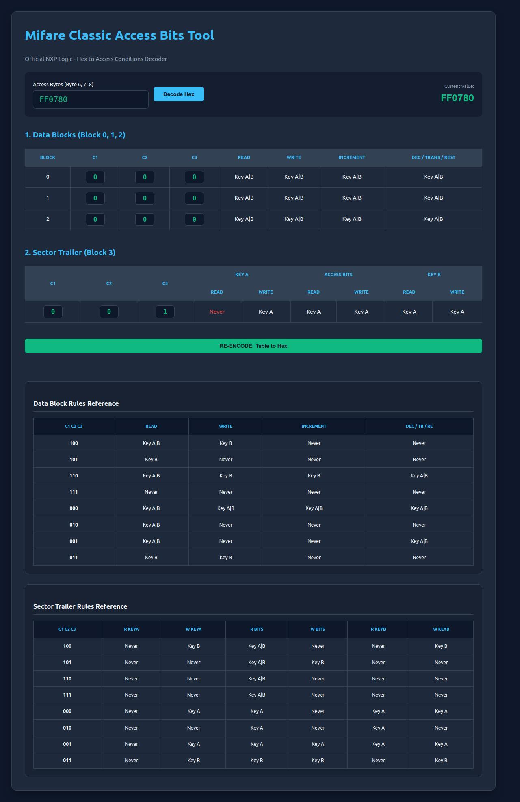

# 🔐 Mifare Classic Access Bits Calculator

> **"Stop bricking your RFID cards!"** > The most precise web-based tool to decode and encode Mifare Classic Access Bits (Bytes 6, 7, 8) without the headache of manual datasheet calculations.

---

## 🛠 Why Do You Need This Tool?
Writing *Access Bits* to a Mifare card is a high-risk operation. A single bit error can lead to a **permanently locked sector (Bricked Card)**. 

This tool is designed to:
- ✅ **Eliminate Guesswork**: Preview your configuration visually before performing a write.
- ✅ **100% Logic Accuracy**: Built using official NXP datasheet bit-inversion algorithms.
- ✅ **Save Time**: Skip the confusing manual bit-mapping and hex conversions.

## ✨ Key Features
- 🎨 **Deep Dark Mode UI**: Modern, futuristic, and developer-friendly interface.
- 🔍 **Instant Decoder**: Paste your 6-character Hex string to reveal all Key A, Key B, and Access Bit permissions instantly.
- 🏗️ **Visual Encoder**: Modify C1, C2, and C3 bits directly in the table and get the encoded Hex string immediately.
- 📑 **Integrated Cheat Sheet**: Comprehensive rule references for both Data Blocks and Sector Trailers right on your screen.
- 🚨 **Safety Highlighting**: Automatic visual warnings (Red highlights) for high-risk "Never" access configurations.

## 📸 Interface Preview

## 🚀 Quick Start
1. Enter your **Access Bytes** (Default: `FF0780`).
2. Click **Decode Hex**.
3. Adjust the bits in the table to suit your system requirements.
4. Click **Re-Encode** and use the generated Hex in your RFID application (MFRC522, ACR122U, Libnfc, etc.).

## 💡 Give it a Star! ⭐
If this tool saved your card from being bricked or simplified your workflow, **please give this repository a Star!** It’s a free way to support the developer and keep this project updated.

---

## 🤝 Contributing
Have a feature suggestion or found a bug? Feel free to open an [Issue](https://github.com/kevzka/mifare-classic-access-bits-calculator/issues) or submit a **Pull Request**. Your contributions are highly appreciated!

## 📜 License
Licensed under the **MIT License**. Use it wisely.

---
*Developed with ☕ and passion for the RFID community.*
